# Домашнее задание к занятию "Система мониторинга Zabbix. Часть 2" - Кучин Виталий Николаевич

### Инструкция по выполнению домашнего задания

   1. Сделайте `fork` данного репозитория к себе в Github и переименуйте его по названию или номеру занятия, например, https://github.com/имя-вашего-репозитория/git-hw или  https://github.com/имя-вашего-репозитория/7-1-ansible-hw).
   2. Выполните клонирование данного репозитория к себе на ПК с помощью команды `git clone`.
   3. Выполните домашнее задание и заполните у себя локально этот файл README.md:
      - впишите вверху название занятия и вашу фамилию и имя
      - в каждом задании добавьте решение в требуемом виде (текст/код/скриншоты/ссылка)
      - для корректного добавления скриншотов воспользуйтесь [инструкцией "Как вставить скриншот в шаблон с решением](https://github.com/netology-code/sys-pattern-homework/blob/main/screen-instruction.md)
      - при оформлении используйте возможности языка разметки md (коротко об этом можно посмотреть в [инструкции  по MarkDown](https://github.com/netology-code/sys-pattern-homework/blob/main/md-instruction.md))
   4. После завершения работы над домашним заданием сделайте коммит (`git commit -m "comment"`) и отправьте его на Github (`git push origin`);
   5. Для проверки домашнего задания преподавателем в личном кабинете прикрепите и отправьте ссылку на решение в виде md-файла в вашем Github.
   6. Любые вопросы по выполнению заданий спрашивайте в чате учебной группы и/или в разделе “Вопросы по заданию” в личном кабинете.
   
Желаем успехов в выполнении домашнего задания!
   
### Дополнительные материалы, которые могут быть полезны для выполнения задания

1. [Руководство по оформлению Markdown файлов](https://gist.github.com/Jekins/2bf2d0638163f1294637#Code)

---

### Задание 1
Создана инфраструктура в Яндекс Облаке при помощи terraform, состоящую из сети, сетевых групп безопасности чтобы открыть порты, трёх ВМ - сервера для Zabbix и двух ВМ с zabbix agent(ами) c DEBUGLEVEL=4.  
При помощи ansible playbook развернуты для сервера в контейнерах PostgresSQL, Zabbix Server, Zabbix WEB Apache PGSQL.
Web интерфейс zabbix сервера работает на порте 8080.  
   
Залогинился на сервер Admin/zabbix.   
Создал шаблон.  
Создал Items для чтения загрузки CPU и оперативной памяти.
Создал макросы с интервалаами опроса вышеуказанных параметров.

Скриншоты.  
  
  
  
  
 
 

### Задание 2 и 3

Задал видимые имена машинам ivanovii-1 и ivanovii-2.  
Привязал собственный шаблон к двум машинам.  
Проверил считывание метрик с агентов в Latest data.     
Добавил шаблон Linux by Zabbix Agent к каждой машине.  
Проверил поступление данных в Latest data.  

  
  
  
 
 
---

### Задание 4

В разделе Dashboards в правом верхнем углу выбра Actions.  
Задал имя дашборда My Dash и частоту обновления.  
Расположил на дашборде виджеты различных видов.

  
  
  

 __РЕЗУЛЬТАТЫ ПРОВЕРКИ__  

Сергей Михалёв
преподаватель
26 декабря 2025 18:58
Добрый вечер, Виталий.

Спасибо за решение.

Рассмотрим его с точки зрения пукнта Требования к результату.

Задание 1.
Прикрепите в файл README.md скриншот страницы шаблона с названием «Задание 1» Шаблон есть, название не соответсмвует.

Задание 2.
Добавьте в Zabbix два хоста и задайте им имена <фамилия и инициалы-1> и <фамилия и инициалы-2>. Например: ivanovii-1 и ivanovii-2. Здесь намёк на использование ваших инициалов. Идея этого пункта- исключить плагиат.

Задание 3.
Прикрепите в файл README.md скриншот страницы хостов, где будут видны привязки шаблонов с названиями «Задание 2-3». Хосты должны иметь зелёный статус подключения. Здесь неточность в задании предлагаю вам просто привязать ваш кастомный шаблон без привязки Linux by Zabbix Agent.

Задание 4.
Прикрепите в файл README.md скриншот дашборда с названием «Задание 4». Дашборд вижу, название- опять мимо.

Отлично что взялись за пятое задание. Только я здесь ничего не понял.
Для получения зачёта попрошу привести решение в соответствие ДЗ. Хотя бы в плане обязательных задания.  

__ДОРАБОТКА__

Задание 1.  
1) Изменил название пользовательского шаблона на "Zadanie1" без пробелов и символов кириллицы.  

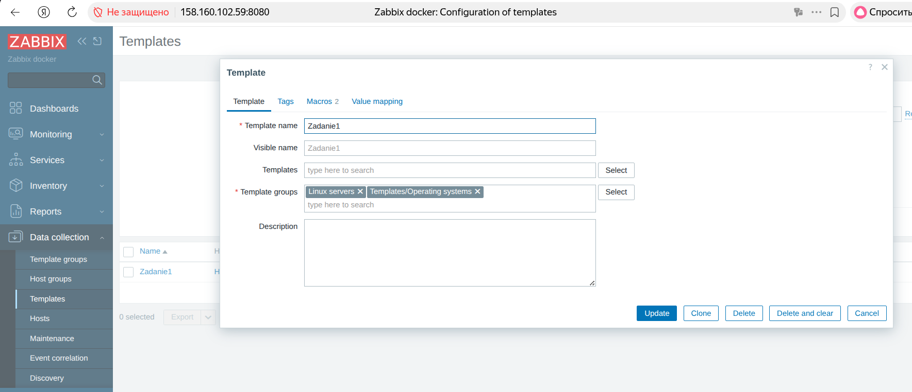  

Задание 2.  
1) Изменил имена пользовательских машин "kuchinvn-1" и "kuchinvn-2".    

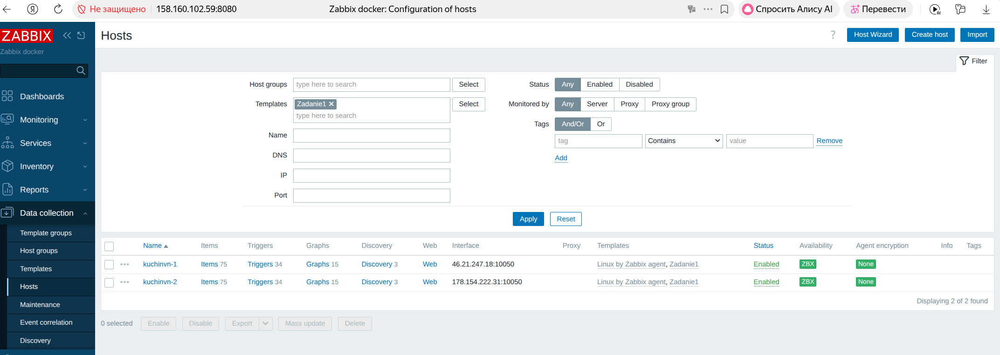

Задание 3.  
1) Шаблон ранее был привязан к хостам. Ничегоне менял. Изменял только имена. Прикладываю шаблон. Кастомный шаблон "Zadanie1" привязан к двум хостам.
2) Отключил от обоих хостов шаблон "Linux by Zabbix agent". Оставил только "Zadanie1".

  
  

### Задание 5

1) Перешёл в Monitoring-Maps.  
2) Создал карту Map1. На ней расположил два хоста и сервер. Добавил два линка.  
3) Добавил в собственный шаблон "Zadanie1" item  AgentPing с ключом 'agent.ping'. 
4) Добавил в шаблон триггер мониторящий вышеуказанный Item.
5) Отредактировал линки и настроил на новый триггер AgentPingTrigger.Установил красный цвет линии и прерывистый тип в случае возникновенния проблемы. В случае нормального состояния цвет линии зелёный и тип сплошной.
4) Проверяем. Останавливал контейнер с Zabbix Agent в машине "kuchinvn-1", перекрывал порт 10050 (yc-user@zabbix1:~$ sudo iptables -A INPUT -p tcp --dport 10050 -j DROP. Линия на карте не краснела.
5) Изменил условие триггера на (last(/Zadanie1/agent.ping)=0 or nodata(/Zadanie1/agent.ping,2m)=1).
6) Получил сработку триггера в Monitor/Problems.    
7) Линия на карте стала красной и прерыввистой.  

  
  
  
  
 

### Задание 6

1) Пишем скрипт в виде задачи в ansible playbook2.yml. Ссылка на файл приложена.  
2) Для этого: cоздаем каталог для Zabbix agent файлов, разворачиваем скрипт возвращающий ФИО или дату, создаем файл конфигурации /srv/zabbix-agent/zabbix_agent2_userparams.conf и записываем в него строку "UserParameter=fio.date[*],/etc/zabbix/userparam_fio_date.sh "$1"",устанавливаем  Zabbix Agent Docker c примонтированными томами и окружением и передаем в контейнер скрипт и конфиг.   
3) В кастомном шаблоне добавляяем два итема: UserParameterFIO и UserParameterDATE c раз.ными аргументами для нашего скрипта. Идём в Latest data и смотрим значения. Они различны.

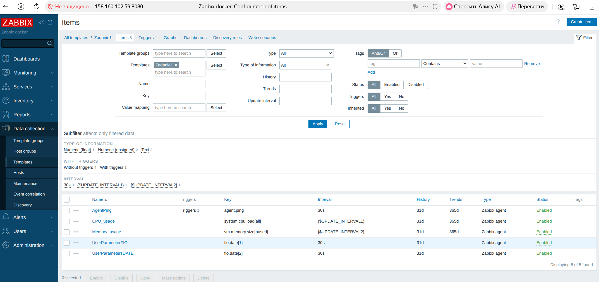  
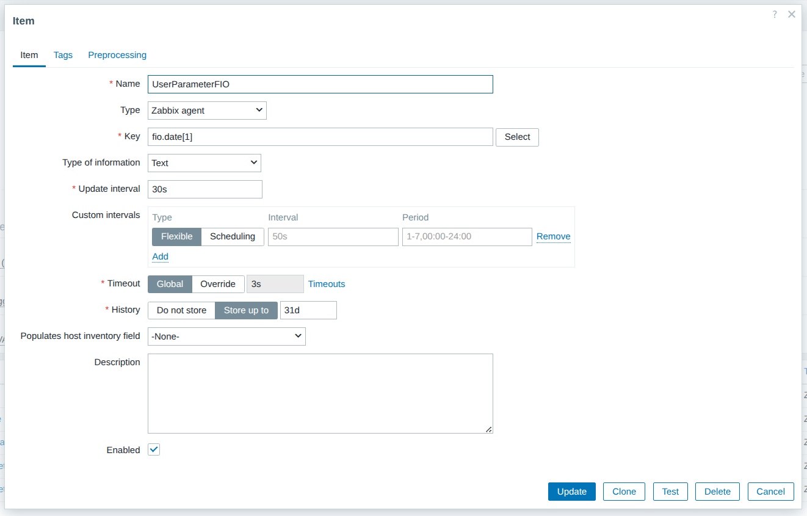  
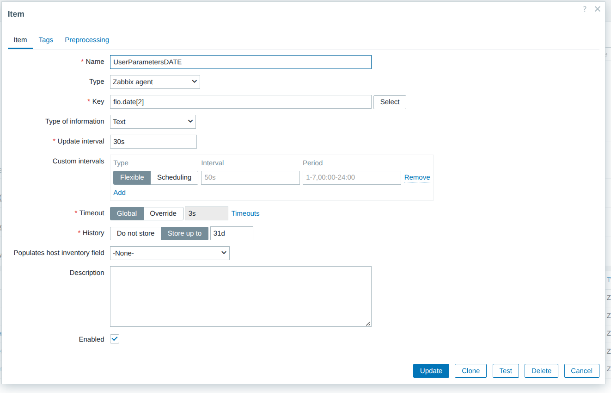  
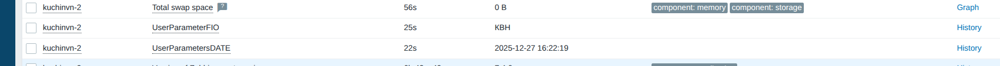  

Ссылки на Ansible playbooks.  

<a href="../playbook1.yml" target="_blank"> Файл playbook1.yml</a>  
<a href="../playbook2.yml" target="_blank"> Файл playbook2.yml</a>  

### Задание 7

1) Дополнил ansible playbook2.yml скриптом Python. Ссылка на файл приложена.  
2) Включил все варианты пользовательских параметров в файл конфигурации zabbix агента с различными ключами
3) В веб интерфейсе сервера создал в пользовательском шаблоне польщзовательские параметры с интервалами опроса и типом ТЕКСТ.
4) Получил значения параметров а Latest data   

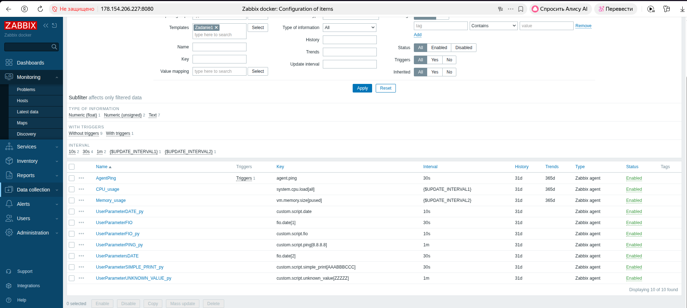  
  
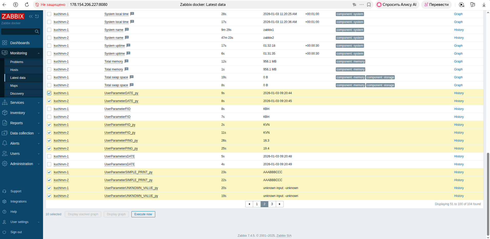  

Ссылки на Ansible playbooks.  

<a href="../playbook2.yml" target="_blank"> Файл playbook2.yml</a>  

### Задание 8

1) Удалил все хосты из списка. 
2) В разделе Data Collections-Discovery - два создаем правила обнаружения агентов Discovery Rule (правый верхний угол).    
3) В разделеAlerts-Discovery actions cоздаем Действие.  
4) Во вкладках создаем действие две операции где привязываем наш шаблон.  
5) В Monitoring- Discovery видим наши хосты.
6) Проваливаемся и видим items.
7) Шаблон привязан 

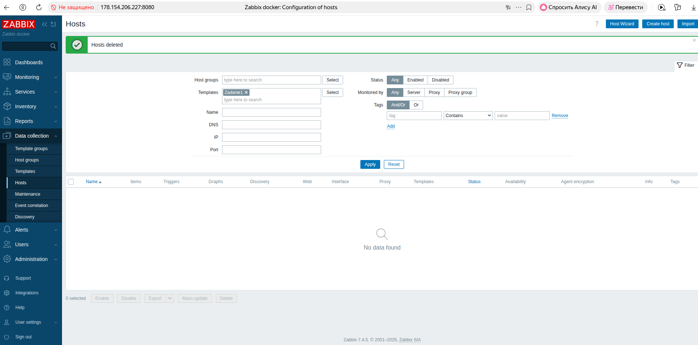  
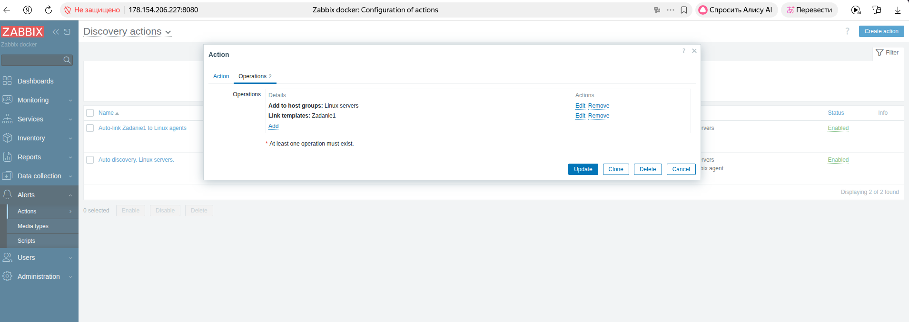  
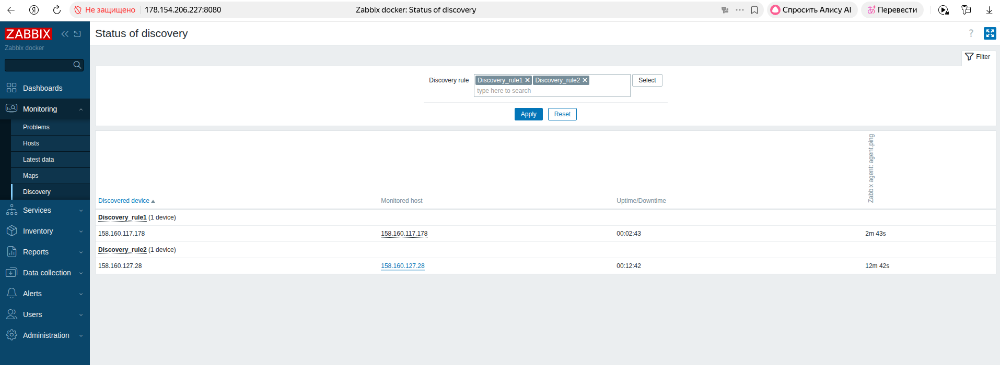  
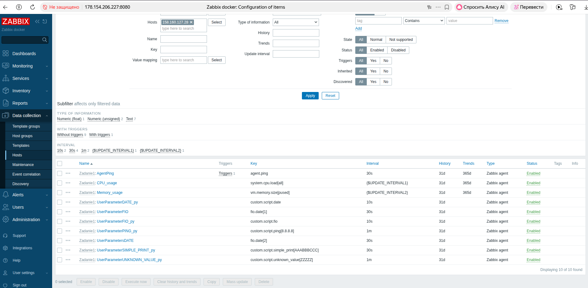  

### Задание 9  

Не выполнялось. 

